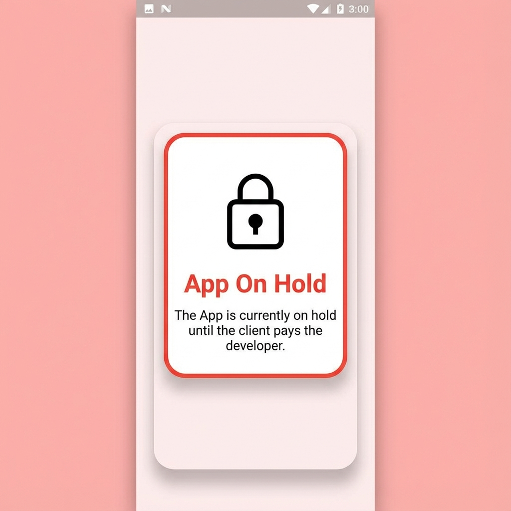
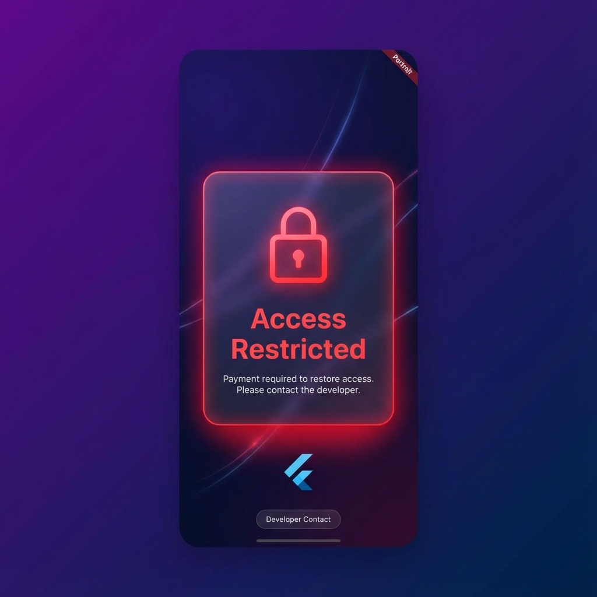

# 📦 remote_app_blocker  

[](https://pub.dev/packages/remote_app_blocker)
[](https://github.com/damscozy/remote_app_blocker)
[](LICENSE)

### Remotely block a Flutter app & show a custom message until payment or compliance is resolved.

`remote_app_blocker` is a Flutter package that lets developers remotely:

- 🚫 Block an app when a client refuses to pay  
- 🔐 Show a custom “App On Hold” message  
- 📡 Pull block status from **HTTP**, **Firestore**, or **Firebase Remote Config**  
- 🔄 Cache last decision when offline  
- 🗓️ Block based on **dates**  
- 🧩 Block specific **app versions**  
- 🔑 Support optional **HMAC integrity signing** (anti-tampering)  
- 🧱 Drop-in wrapper for any existing Flutter application  

This package is commonly used by freelancers and agencies who need a clean, non-invasive way to disable apps until invoices are paid — without modifying client code.

---

## 🖼 Screenshots

Default blocked page (light theme):



Optional custom styling example:



> Place your PNG screenshots under `screenshots/` with the above names, or update paths accordingly.

---

## ✨ Features

- **Remote control** via JSON, Firestore, or Firebase Remote Config  
- **Real-time updates** (auto-refresh UI when status changes)
- **Block by flag** (`isBlocked = true`)  
- **Block specific app versions** (`blockedVersions`)  
- **Schedule-based blocking** (`blockFrom` / `blockUntil`)  
- **Custom message** from server (e.g.  
  `The App is currently on hold until the client pays the developer.`)  
- **Offline cache fallback**  
- **Optional HMAC signature verification** for remote config  
- **Simple integration** – wrap your app in one widget  

---

## 📥 Installation

Add to your `pubspec.yaml`:

```yaml
dependencies:
  remote_app_blocker: ^0.0.3
```

## 🚀 Quick Start

```dart
import 'package:flutter/material.dart';
import 'package:remote_app_blocker/remote_app_blocker.dart';

void main() {
  runApp(const MyRoot());
}

class MyRoot extends StatelessWidget {
  const MyRoot({super.key});

  @override
  Widget build(BuildContext context) {
    return RemoteAppGate(
      appVersion: "1.0.0", // example — use package_info_plus to fetch real version
      
      // Check for updates every 5 minutes (default)
      refreshInterval: const Duration(minutes: 5),

      // Timeout for initial load (default: 10 seconds)
      initTimeout: const Duration(seconds: 10),

      // Callback when status changes
      onStatusChanged: (isBlocked, message) {
        print("Block status changed: $isBlocked");
      },

      providers: [
        HttpBlockStatusProvider(
          url: "https://yourdomain.com/app-status.json",
          hmacSecret: "SUPER_SECRET_KEY_CHANGE_ME", // optional but recommended
        ),
      ],

      blockedBuilder: (context, msg) {
        return Scaffold(
          backgroundColor: Colors.red.shade50,
          body: Center(
            child: Padding(
              padding: const EdgeInsets.all(24.0),
              child: Text(
                msg,
                textAlign: TextAlign.center,
                style: const TextStyle(
                  fontSize: 22,
                  color: Colors.red,
                  fontWeight: FontWeight.bold,
                ),
              ),
            ),
          ),
        );
      },

      child: MaterialApp(
        title: 'Remote App Blocker Demo',
        home: const HomePage(),
      ),
    );
  }
}

class HomePage extends StatelessWidget {
  const HomePage({super.key});

  @override
  Widget build(BuildContext context) {
    return const Scaffold(
      body: Center(child: Text("App Running Normally")),
    );
  }
}
```

---

## 🌐 Remote JSON Format (HTTP Source)
Upload a JSON file such as:
```json
{
  "isBlocked": true,
  "blockMessage": "The App is currently on hold until the client pays the developer.",
  "blockedVersions": [],
  "blockFrom": null,
  "blockUntil": null
}
```

**Unblock:**

```json
{
  "isBlocked": false,
  "blockMessage": "",
  "blockedVersions": []
}
```

---

## ⚙️ Advanced Blocking Rules

### 🔹 Block a specific app version

```json
{
  "isBlocked": false,
  "blockMessage": "This version is disabled.",
  "blockedVersions": ["1.0.0"]
}
```

### 🔹 Scheduled blocking (block between dates)

```json
{
  "isBlocked": false,
  "blockMessage": "Access paused until payment is received.",
  "blockFrom": "2025-01-01T00:00:00Z",
  "blockUntil": "2025-01-31T23:59:59Z"
}
```

### 🔹 Forced block

```json
{
  "isBlocked": true,
  "blockMessage": "Your access has been blocked. Contact the developer.",
  "blockedVersions": []
}
```

---

## 🔒 Optional Security (HMAC Signature)

To prevent clients from editing JSON on their own server, you can attach a signature:

```json
{
  "isBlocked": true,
  "blockMessage": "App on hold.",
  "blockedVersions": [],
  "blockFrom": null,
  "blockUntil": null,
  "signature": "HEX_DIGEST_SHA256"
}
```

Using these fields (in this order):

`isBlocked` | `blockMessage` | `blockedVersions` | `blockFrom` | `blockUntil`

The Flutter package will recompute and verify this signature if `hmacSecret` is provided to `HttpBlockStatusProvider`.

See **Automated HMAC signing scripts** below for ready-made backend tools.

---

## 🔥 Firebase Support

### Firestore

Create a document (e.g. apps/your_app_id) containing the same JSON schema.

Example document:

```json
{
  "isBlocked": true,
  "blockMessage": "The App is currently on hold until the client pays the developer.",
  "blockedVersions": [],
  "blockFrom": null,
  "blockUntil": null
}

```

**Use provider:**

```dart
FirestoreBlockStatusProvider(
  firestore: FirebaseFirestore.instance,
  collectionPath: "apps",
  documentId: "your_app_id",
),
```

### Firebase Remote Config

Set a parameter (e.g. `app_block_config`) to a JSON string with the same schema.

**Use provider:**

```dart
RemoteConfigBlockStatusProvider(
  remoteConfig: FirebaseRemoteConfig.instance,
  key: "app_block_config",
),
```
---

## 🧩 API Overview

### Providers

| Provider | Source | Use Case |
|----------|--------|----------|
| `HttpBlockStatusProvider` | JSON over HTTP | Most freelancers/agencies |
| `FirestoreBlockStatusProvider` | Firestore document | Real-time, multi-tenant apps |
| `RemoteConfigBlockStatusProvider` | Firebase Remote Config | Feature flag / config toggles |

### Main Widget

```dart
RemoteAppGate(
  providers: [...],
  child: MaterialApp(...),
);
```

---

## ⚙️ Automated HMAC Signing Scripts (Backend)

Use these scripts to generate JSON + signature on the server side.

### Node.js (CLI tool)

**File:** `tools/sign-config.js`

#!/usr/bin/env node
const crypto = require("crypto");

const secret = process.env.RAB_HMAC_SECRET || "SUPER_SECRET_KEY_CHANGE_ME";

function signConfig(config) {
  const payload = [
    config.isBlocked,
    config.blockMessage || "",
    (config.blockedVersions || []).join(","),
    config.blockFrom || "",
    config.blockUntil || "",
  ].join("|");

  const signature = crypto
    .createHmac("sha256", secret)
    .update(payload)
    .digest("hex");

  return { ...config, signature };
}

// Example usage: node sign-config.js config.json > out.json
if (require.main === module) {
  const fs = require("fs");
  const inputPath = process.argv[2];

  if (!inputPath) {
    console.error("Usage: node sign-config.js <config.json>");
    process.exit(1);
  }

  const raw = fs.readFileSync(inputPath, "utf8");
  const config = JSON.parse(raw);
  const signed = signConfig(config);
  process.stdout.write(JSON.stringify(signed, null, 2));
}

module.exports = { signConfig };

```

**Usage:**

```bash
export RAB_HMAC_SECRET="SAME_SECRET_AS_IN_APP"
node tools/sign-config.js config.json > app-status.json
```

---

### Python script

**File:** `tools/sign_config.py`

```py
#!/usr/bin/env python3
import hmac
import hashlib
import json
import os
import sys

SECRET = os.getenv("RAB_HMAC_SECRET", "SUPER_SECRET_KEY_CHANGE_ME")


def sign_config(config: dict) -> dict:
    payload = "|".join([
        str(config.get("isBlocked", False)),
        config.get("blockMessage", "") or "",
        ",".join(config.get("blockedVersions", []) or []),
        config.get("blockFrom", "") or "",
        config.get("blockUntil", "") or "",
    ])

    signature = hmac.new(
        SECRET.encode("utf-8"),
        payload.encode("utf-8"),
        hashlib.sha256,
    ).hexdigest()

    config["signature"] = signature
    return config


if __name__ == "__main__":
    if len(sys.argv) < 2:
        print("Usage: sign_config.py <config.json>", file=sys.stderr)
        sys.exit(1)

    path = sys.argv[1]
    with open(path, "r", encoding="utf-8") as f:
        config = json.load(f)

    signed = sign_config(config)
    print(json.dumps(signed, indent=2))

```

**Usage:**

```bash
export RAB_HMAC_SECRET="SAME_SECRET_AS_IN_APP"
python tools/sign_config.py config.json > app-status.json
```

---

### PHP function

**File:** `tools/sign_config.php`
```php
<?php

function sign_config(array $config, string $secret): array
{
    $isBlocked = $config['isBlocked'] ?? false;
    $blockMessage = $config['blockMessage'] ?? '';
    $blockedVersions = isset($config['blockedVersions']) && is_array($config['blockedVersions'])
        ? implode(',', $config['blockedVersions'])
        : '';
    $blockFrom = $config['blockFrom'] ?? '';
    $blockUntil = $config['blockUntil'] ?? '';

    $payload = implode('|', [
        $isBlocked ? 'true' : 'false',
        $blockMessage,
        $blockedVersions,
        $blockFrom,
        $blockUntil,
    ]);

    $signature = hash_hmac('sha256', $payload, $secret);
    $config['signature'] = $signature;

    return $config;
}
```

---

## ❤️ Contributing

PRs and issues welcome! Feel free to contribute improvements, bug fixes, or additional providers.

## 📝 License

MIT License - see [LICENSE](LICENSE) file for details.